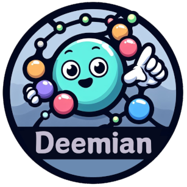

# Deemian DSL

[](https://deemian-dsl.readthedocs.io/en/latest/)
[](https://codecov.io/gh/radifar/deemian)
[](https://github.com/radifar/deemian/releases)
[]()

<p align="center">
  
</p>

Deemian is a Domain Specific Language (DSL) that serves as a tool and programming language for molecular interaction analysis. The language uses the vocabulary of cheminformatics and bioinformatics domains, making it simple and intuitive. Despite its simplicity, it is a powerful tool that allows for systematic analysis. The script is easy to read and modify, which enhances readability, reproducibility, and reusability in molecular interaction studies.

## Feature

At the moment Deemian only have minimum feature, in the future more feature will be added as decribed in the [Roadmap](https://deemian-dsl.readthedocs.io/en/latest/information/roadmap.html).

Here is the list of current Deemian feature:
- PDB file processing, both single (X-ray crystal structure) and multimodel (NMR solution structure).
- Molecule bond assignment based on SMILES template.
- Electrostatic interaction analysis.
- Allows both apparent and ionizable charge identification.
- Interaction calculation between two selection.
- Present interaction in detailed, clustered, and summarized mode.
- Generate Deemian data which can be viewed with Deemian Viewer.

## Quick Tour

Here is an example of Deemian script to analyze the interaction between oseltamivir and neuraminidase in a crystal structure (PDB ID: 5nzn)

```
molecule 5nzn.pdb [
    select protein_A = chain A and protein
    select oseltamivir = chain A and resname G39
    assign bond oseltamivir template CCC(CC)O[C@@H]1C=C(C[C@@H]([C@H]1NC(=O)C)N)C(=O)O
]

measure protein_ligand [
    interactions all
    ionizable positive true
    ionizable negative true
    between oseltamivir and protein_A
]

present protein_ligand [
    interactions protein_ligand.txt
    deemiandata protein_ligand.dd
]
```

Which will generate this readable output

```
Deemian version: 0.1.0

interaction for "oseltamivir:protein_A":
conf          1
    ELECTROSTATIC as_cation:

                         oseltamivir protein_A

    id                   4           562     563     1053
    atom_name            N4          OE1     OE2     OD1
    res_name             G39         GLU     GLU     ASP
    res_num.chain        503.A       119.A   119.A   151.A
    distance                         4.206   2.744   3.157

    ELECTROSTATIC as_anion:

                         oseltamivir protein_A

    id                   0           539     540     541     4295    4296    4297
    atom_name            O1A         CZ      NH1     NH2     CZ      NH1     NH2
    res_name             G39         ARG     ARG     ARG     ARG     ARG     ARG
    res_num.chain        503.A       118.A   118.A   118.A   368.A   368.A   368.A
    distance                         3.646   2.800   3.584   3.625   2.832   3.523

    id                   1           3182    3183    3184    4295    4296    4297
    atom_name            O1B         CZ      NH1     NH2     CZ      NH1     NH2
    res_name             G39         ARG     ARG     ARG     ARG     ARG     ARG
    res_num.chain        503.A       293.A   293.A   293.A   368.A   368.A   368.A
    distance                         3.547   3.181   3.015   3.702   3.677   2.833
```

And Deemian Data file which can be viewed with [Deemian Viewer](https://deemian-viewer.readthedocs.io/en/latest/)

https://github.com/radifar/deemian_viewer/assets/11450417/066588a0-d704-4759-8d80-3e56b67c4b54

## Installation

To install Deemian, download the latest version from the [Deemian release page](https://github.com/radifar/deemian/releases). Extract the zip / tar.gz file and run the `pip install` command, using the directory name as the last argument:

```bash
pip install deemian-0.1.0
```

Check the [documentation](https://deemian-dsl.readthedocs.io/en/latest/usage/installation.html) for more detailed instruction.

## Usage

For more detailed usage checkout the [Getting Started](https://deemian-dsl.readthedocs.io/en/latest/usage/gettingstarted.html) guide and [Tutorial](https://deemian-dsl.readthedocs.io/en/latest/usage/tutorial.html) pages on Documentation.

## Contributing

Interested in contributing? Check out the contributing guidelines. Please note that this project is released with a Code of Conduct. By contributing to this project, you agree to abide by its terms.

## License

`deemian` was created by Muhammad Radifar. It is licensed under the terms of the Apache License 2.0 license.

## Credits

`deemian` was created with [`cookiecutter`](https://cookiecutter.readthedocs.io/en/latest/) and the `py-pkgs-cookiecutter` [template](https://github.com/py-pkgs/py-pkgs-cookiecutter).
